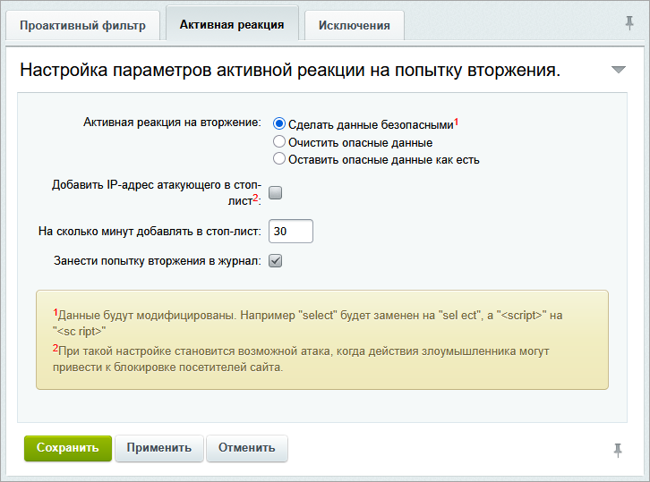
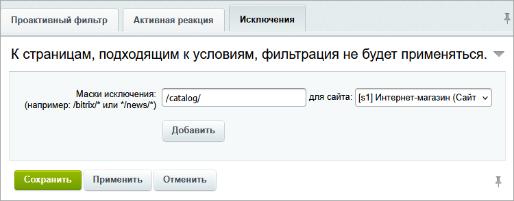
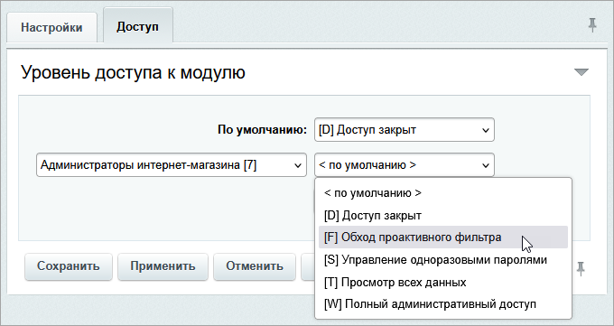

В Bitrix Framework есть встроенный инструмент для защиты веб-приложений от вредоносного кода -- Проактивный фильтр (Web Application Firewall). Он анализирует HTTP-запросы и блокирует распространенные атаки: SQL-инъекции, XSS и другое.


 

Проактивный фильтр дополняет, но не заменяет обычный антивирус и серверные средства защиты.



## Как включить Проактивный фильтр (WAF)

1. В административном разделе перейдите в *Настройки > Проактивная защита > Проактивный фильтр*.

2. Нажмите Включить проактивную защиту.

## Как настроить Проактивный фильтр

Откройте форму Активная реакция, чтобы настроить действия системы при попытке вторжения на сайт.

1. В поле *Активная реакция на вторжение* задайте реакцию системы на вторжение.

   -  **Сделать данные безопасными**. Система модифицирует потенциально опасные данные: `select` > `sel ect`, `<script>` > `<sc ript>`.

   -  **Очистить опасные данные**. Система полностью удалит вредоносные фрагменты.

   -  **Оставить опасные данные как есть**. Система не будет выполнять никаких действий с опасными данными.

2. **Добавить IP-адрес атакующего в стоп-лист**. Включите эту опцию, чтобы система автоматически блокировала подозрительный IP-адрес. При такой настройке возможны ложные срабатывания. Например, если пользователь отправляет данные, похожие на атаку, или использует общий IP-адрес (прокси, NAT).

3. **На сколько минут добавлять в стоп-лист**. В этом поле укажите время блокировки IP-адреса в минутах.

4. **Занести попытку вторжения в журнал**. Активируйте эту настройку, чтобы фиксировать все подозрительные действия для последующего анализа.

{width=726px height=539px}

## Как настроить исключения для Проактивного фильтра

Вы можете задать исключения из Проактивного фильтра для страниц и для пользователей.


 

Для защиты на стандартном уровне включите Проактивный фильтр и не задавайте исключения.



### Исключения для страниц

1. Откройте страницу *Настройки > Проактивная защита > Проактивный фильтр*.

2. Перейдите на вкладку Исключения.

3. В поле *Маски исключения* укажите шаблоны путей, которые нужно исключить из обработки. Настройка работает для конкретного сайта и для всех сайтов на сервере.

{width=750px height=294px}

Примеры масок исключения:

-  `/bitrix/*` исключает все файлы и папки внутри директории `/bitrix/`,

-  `*/news/*` исключает любые пути, содержащие `/news/` в середине URL.

**Примечание.** Знак `*` заменяет любое количество символов, кроме `/`. Относительные пути указывают от корня сайта.

### Исключения для пользователей

1. Откройте страницу *Настройки > Настройки продукта > Настройки модулей > Проактивная защита*.

2. Перейдите на вкладку Доступ.

3. Для нужных групп пользователей выберите уровень доступа `[F] Обход проактивного фильтра`.

   {width=680px height=361px}

### Как IP-адреса попадают в стоп-лист

Стоп-лист автоматически блокирует подозрительные IP-адреса, чтобы предотвратить их доступ к сайту.

IP-адреса попадают в стоп-лист автоматически в двух случаях.

-  Если включена защита административной части сайта.

-  Когда настроена автоматическая блокировка подозрительных IP-адресов и Проактивный фильтр обнаруживает вторжение.

### Как вручную добавить правило блокировки

Правило блокировки запрещает доступ указанным IP-адресам или диапазонам IP-адресов к конкретным разделам сайта.

1. Перейдите на страницу *Настройки > Проактивная защита > Стоп-лист*.

2. Нажмите Добавить.

3. Выберите область блокировки: административный раздел, публичную часть сайта или оба варианта.

4. Укажите IP-адреса или диапазоны адресов, которые нужно заблокировать.

5. Укажите маски путей или разделы сайта, доступ к которым нужно заблокировать. Например, `/admin/*`.

6. Задайте исключения по IP-адресам и маскам путей.

   
 

   Каждый IP-адрес или маску пути вводите в отдельное поле с помощью кнопки Добавить. Диапазон IP-адресов указывайте через дефис. Например, `192.168.0.1-192.168.0.100`.

   


{width=617px height=711px}

#### Результат блокировки

Пользователи с заблокированными IP-адресами при попытке зайти на сайт получат ошибку `HTTP 403 – доступ запрещен`.