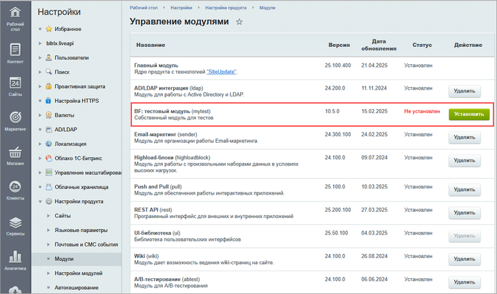
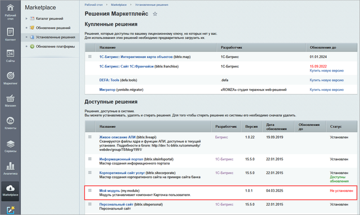

Bitrix Framework состоит из модулей. Каждый модуль реализует определенную функциональность: управление контентом, email-рассылки, реклама и другие.

## Что такое модуль

Модуль -- это автономный блок кода, который может включать:

-  API для данных, бизнес-логики, интерфейса,

-  HTML-верстку,

-  компоненты,

-  административные разделы.

Большинство модулей работают автономно, но часть из них расширяет функциональность других:

-  *Торговый каталог* добавляет к *Информационным блокам* функции цен, скидок и наценок.

-  *Документооборот* работает с данными из *Информационных блоков* и *Управления структурой*.

## Пользовательские модули

Разработчики могут создавать свои модули в Bitrix Framework. Пользовательские модули размещают в папке `/local/modules/`. Это обеспечивает четкое разделение между системными файлами и кастомизацией. Папка `/local/` не перезаписывается при обновлениях системы, поэтому ваши разработки останутся нетронутыми.

Для каждого модуля нужно создать отдельную папку в `/local/modules/`. Название корневой папки модуля совпадает с идентификатором модуля.



Идентификатор модуля должен соответствовать правилам:

-  задан в нижнем регистре,

-  первый символ не является цифрой,

-  не содержит знака нижнего подчеркивания `_`.



Пользовательские модули можно разделить на собственные и партнерские.

### Собственные модули

Собственный модуль -- это модуль, который разрабатывают и используют в рамках своего веб-проекта. При его создании соблюдают правило: идентификатор, название папки и класса одинаковы и написаны одним словом, например, `mytest`.

Собственные модули устанавливают из списка на странице *Настройки > Настройки продукта > Модули.*

{width=720px height=426px}

### Партнерские модули

Партнерский модуль -- это модуль, который разрабатывают партнеры 1С-Битрикс и размещают на [Маркетплейсе](https://marketplace.1c-bitrix.ru/) после модерации. Любой клиент 1С-Битрикс может установить такой модуль в свой проект.

Идентификатор партнерского модуля -- это уникальный код вида `partner.module`. Он состоит из кода партнера и названия модуля, которые разделены точкой.

Чтобы создать название класса, в идентификаторе модуля замените точку на нижнее подчеркивание: `partner_module`.

Для модуля с идентификатором `partner.module` пространство имен будет `\Partner\Module`. Здесь точка заменяется на обратный слеш `\`, и каждое слово начинается с заглавной буквы.

Партнерские модули можно установить со страницы *Marketplace > Установленные решения*.

{width=720px height=430px}

## Пример создания модуля

Добавим в систему модуль `my.module`. Он установит компонент *Карточка пользователя*.

### Структура модуля

1. Создайте папку `my.module` в `/local/modules/`.

2. Добавьте папки и файлы с описанием, версией, языковыми файлами и конфигурацией модуля в `/local/modules/my.module/`.

3. В папке `/local/modules/my.module/install/components/` создайте компонент `my:user.card`. Подробности читайте в статье [Создание компонента](./create-component).

```
/local/modules/my.module/
├── install/
│   ├── components/
│   │   └── my/
│   │       └── user.card/        // Компонент Карточка пользователя
│   │           ├── .description.php
│   │           ├── .parameters.php
│   │           ├── class.php
│   │           ├── templates/
│   │           │   └── .default/
│   │           │       ├── template.php
│   │           │       ├── script.js
│   │           │       └── style.css
│   │           └── lang/
│   │               └── ru/
│   │                  └── messages.php
│   ├── index.php                 // Основной файл установки
│   └── version.php               // Версия модуля
├── lang/
│   └── ru/
│       └── install/
│           └──index.php          // Языковой файл установки
└── .settings.php                 // Файл с конфигурацией
```



О структуре файлов модуля читайте в разделе [Модули](./../moduli/_index).



#### Основной файл установки

Файл `/install/index.php` описывает класс модуля. Класс `my_module` состоит из следующих частей:

-  конструктора -- загружает файл `version.php`, название и описание модуля,

-  методов установки и удаления: `DoInstall()` и `DoUninstall()`,

-  методов работы с базой данных: `InstallDB()` и `UnInstallDB()`,

-  методов работы с файлами: `InstallFiles()` и `UnInstallFiles()`.

В метод `InstallFiles()` добавьте вызов `CopyDirFiles`. Он скопирует компонент `my:user.card` из папки установки модуля в рабочую папку `/local/components/`.

В методе `UnInstallFiles()` используйте `DeleteDirFilesEx` для удаления файлов компонента.

```php
<?php

use Bitrix\Main\Localization\Loc;
use Bitrix\Main\ModuleManager;

class my_module extends CModule
{
    public $MODULE_ID = 'my.module';
    public $MODULE_VERSION;
    public $MODULE_VERSION_DATE;
    public $MODULE_NAME;
    public $MODULE_DESCRIPTION;

	public function __construct()
	{
		include __DIR__ . '/version.php';

		if (isset($arModuleVersion['VERSION'], $arModuleVersion['VERSION_DATE']))
		{
			$this->MODULE_VERSION = $arModuleVersion['VERSION'];
			$this->MODULE_VERSION_DATE = $arModuleVersion['VERSION_DATE'];
		}

		$this->MODULE_NAME = Loc::getMessage('MY_MODULE_MODULE_NAME');
		$this->MODULE_DESCRIPTION = Loc::getMessage('MY_MODULE_MODULE_DESCRIPTION');
	}
	
	public function DoInstall()
	{
		global $USER;
		
		if (!$USER->IsAdmin())
		{
			return;
		}
		
		ModuleManager::registerModule($this->MODULE_ID);

		$this->InstallDB();
		$this->InstallFiles();
	}

	public function DoUninstall()
	{
		global $USER;
		
		if (!$USER->IsAdmin())
		{
			return;
		}
		
		$this->UnInstallFiles();
		$this->UnInstallDB();
		
		ModuleManager::unRegisterModule($this->MODULE_ID);
	}

	public function InstallDB()
	{
		// зарегистрировать зависимости на события модулей
		$eventManager = \Bitrix\Main\EventManager::getInstance();
		$eventManager->registerEventHandler('...');
		
		// добавить агенты
		\CAgent::AddAgent(...);
		
		// добавить пользовательские поля
		$userType = new \CUserTypeEntity();
		$userType->Add(...);
	}

	public function UnInstallDB()
	{
		// удалить все зависимости на событиях
		$eventManager = \Bitrix\Main\EventManager::getInstance();
		$eventManager->unRegisterEventHandler('...');
		
		// агенты можно не удалять, они будут удалены автоматически
		
		// удалить пользовательские поля
		$userType = new \CUserTypeEntity();
		$userType->Delete(...);
	}

	public function InstallFiles()
	{
		CopyDirFiles($_SERVER['DOCUMENT_ROOT'] . '/local/modules/my.module/install/components', $_SERVER['DOCUMENT_ROOT'] . '/local/components', true, true);
	}

	public function UnInstallFiles()
	{
		DeleteDirFilesEx('/local/components/my');
		return true;
	}
}
?>
```



Методы работы с базой данных `InstallDB()` и `UnInstallDB()` приведены для примера. В них могут быть включены операции по добавлению и удалению обработчиков событий, агентов и других данных.

При копировании кода методы нужно оформить самостоятельно или удалить.



#### Файл с версией

Файл `/install/version.php` содержит информацию о версии модуля. Версия не может быть равна нулю.

```php
<?php
$arModuleVersion = [
	'VERSION' => '1.0.1',
	'VERSION_DATE' => '2025-03-04 16:10:25'
];
?>
```

#### Файл с базовой конфигурацией

Файл `.settings.php` описывает настройки модуля. В настройках для контроллеров укажите пространство имен.

```php
<?php
return [
    'controllers' => [
        'value' => [
            'defaultNamespace' => '\\My\\Module\\Controller',
        ],
        'readonly' => true,
    ]
];
?>
```

#### Языковой файл установки

Файл `/lang/ru/install/index.php` содержит переводы текстов, которые используются в файле установки `/install/index.php`.

```php
<?
$MESS ['MY_MODULE_MODULE_NAME'] = "Мой модуль";
$MESS ['MY_MODULE_MODULE_DESCRIPTION'] = "Модуль устанавливает компонент Карточка пользователя.";
?>
```

Модуль создан. Его можно дополнить необходимым функционалом, например, добавить контроллер.



[Создание контроллера](./create-controller)



## Архив с примером модуля

Все файлы модуля с контроллером можно [скачать в архиве](https://dev.1c-bitrix.ru//docs/chm_files/my.module.zip). Для работы распакуйте архив в папку `/local/modules/`.