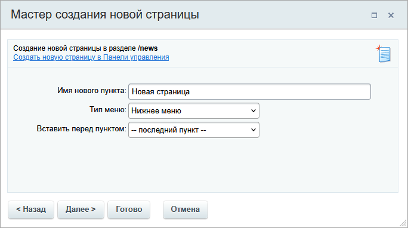
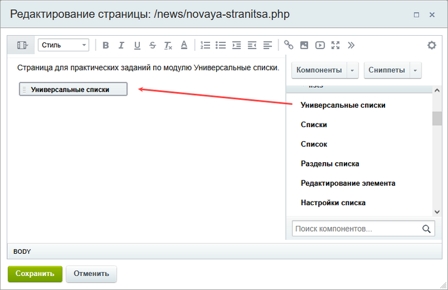
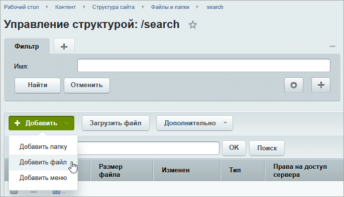
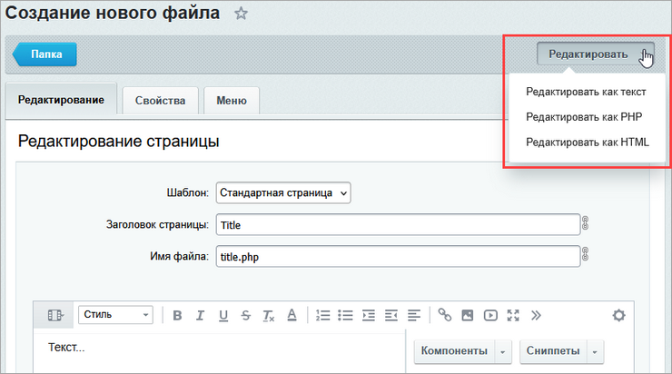
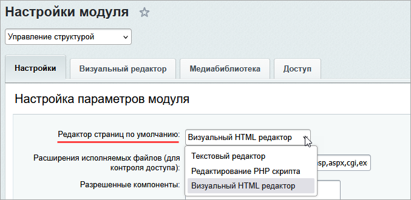

В Bitrix Framework страницы можно создавать двумя способами.

-  Через файловую систему -- для кастомных страниц и разработки.

-  С помощью интерфейса системы -- чтобы быстро создать контент.

## Как создать страницу вручную

1. Перейдите в нужную директорию сайта или создайте новую папку. Например, `my-page`.

2. Внутри папки создайте файл, например, `index.php`.

3. Подключите `header.php` и `footer.php`.

4. Добавьте содержимое страницы.

```php
<?php  
// header.php — верхняя часть сайта
require($_SERVER['DOCUMENT_ROOT'] . '/bitrix/header.php');  
?>  

<!-- содержимое страницы -->  

<?php  
// footer.php — нижняя часть сайта
require($_SERVER['DOCUMENT_ROOT'] . '/bitrix/footer.php');  
?>  
```

### Настройка метаданных

1. Создайте файл `.section.php` в папке страницы. Он задает метаданные раздела для SEO.

2. Добавьте метаданные в `.section.php`.

```php
<?php
$sSectionName = "Название раздела";
$arDirProperties = array(
    'title' => 'SEO заголовок',
    "description" => "Описание страницы",
    "keywords" => "Ключевые слова"
);
?>
```

Информация из файла `/my-page/.section.php` будет использоваться при формировании навигационной цепочки и мета-тегов.

## Как создать страницу через интерфейс

Страницу можно создать c помощью инструментов публичного и административного разделов сайта.

### Публичный раздел

В публичном разделе сайта можно создать страницу с помощью мастера. Для этого перейдите в нужный раздел сайта, откройте меню создания страницы на административной панели и нажмите *Создать страницу*.

{width=543px height=314px}

#### Мастер создания страницы

1. Заполните основные параметры.

   -  Заголовок страницы -- отображается пользователям на странице сайта,

   -  Имя файла -- название файла в файловой структуре сайта. По умолчанию формируется из заголовка.

   Отметьте необходимые опции:

   -  Перейти к редактированию страницы -- если опция отмечена, после мастера будет открыт визуальный редактор для редактирования страницы. Чтобы создать пустую страницу, снимите флаг.

   -  Добавить пункт меню -- если опция отмечена, в меню будет добавлен пункт со ссылкой на страницу. Чтобы страница не отображалась в меню, снимите флаг.

   -  Ограничить доступ к странице -- установите, если необходимо настроить показ страницы для групп пользователей. Если флаг снят, то доступ к странице не ограничен.

   Выбор опций влияет на количество шагов мастера. Если все опции неактивны, мастер состоит из одного шага.

   {width=684px height=382px}

2. Настройте пункт меню, если включено на первом шаге мастера.

   -  Имя нового пункта -- название в меню.

   -  Тип меню -- выберите, куда добавить страницу.

   -  Вставить перед пунктом -- укажите, перед каким пунктом вставить страницу.

   {width=684px height=382px}

   На этом шаге будет создан отдельный файл для меню раздела. Это переопределит основное меню по правилам наследования. Проверьте и при необходимости отредактируйте меню.

   {width=740px height=448px}

3. Настройте свойства страницы. Вы можете изменить значения, которые наследуются из раздела.

   -  Описание страницы и Ключевые слова -- для поисковых систем.

   -  Заголовок в браузере -- текст на закладке браузера.

   -  Продвигаемые слова и ROBOTS -- настройки для SEO.

   -  Теги -- для внутреннего поиска. Функция активна при установленном флажке справа от поля.

   {width=740px height=456px}

4. Нажмите Готово, чтобы выйти из мастера.

5. Если в мастере разрешен переход к редактированию, добавьте текст или компоненты на страницу.

   {width=740px height=479px}

#### Страницы по шаблону

Для однотипных страниц используйте шаблоны. Шаблоны должны быть созданы заранее.

1. На административной панели нажмите *Создать страницу > По шаблону*.

2. Выберите шаблон.

3. Пройдите шаги мастера.

Страница будет создана с текстом из шаблона.

### Административный раздел

1. Откройте в файловой структуре папку, где нужно создать страницу.

2. Нажмите *Добавить > Добавить файл*.

   {width=685px height=393px}

3. Заполните поля в форме с настройками страницы. Они повторяют параметры из мастера [выше](./create-page#публичный-раздел).

4. Добавьте содержимое страницы с помощью редактора. Редактор можно сменить по кнопке Редактировать.

   {width=740px height=412px}

   Тип редактора зависит от настроек модуля Управление структурой. Для режимов *Редактировать как текст* и *Редактировать как PHP* доступна подсветка синтаксиса и нумерация строк.

   {width=677px height=330px}