Защита сайта от хакерских атак, взлома и кражи данных -- важная задача для любого проекта, даже если он не подключен к интернету.

Хакерские атаки используют скрытые возможности приложений для выполнения неожиданных действий, которые разработчики не предусмотрели.

## Типы уязвимостей веб-приложений

Уязвимости сайта -- это недостатки в системе, которые позволяют нарушить работу сайта или украсть данные пользователей.

Уязвимости делятся на два типа.

1. Атаки на систему.

2. Атаки на клиентов веб-приложений.

### Атаки на систему

Это атаки, которые направлены непосредственно на систему без использования сторонних программ.

-  SQL-инъекция. Распространенная атака, которая связана с недостаточной фильтрацией данных, и позволяет выполнить произвольные SQL-запросы. В Bitrix Framework прямое обращение к базе не рекомендуется, но разработчики иногда нарушают это правило.

-  Внедрение в имя файла. Уязвимость возникает, когда в имени файла используется недостаточно фильтруемое значение от пользователя. Можно изменить имя файла для выполнения произвольного PHP-файла.

-  Выполнение системных команд. Уязвимость связана с недостаточной фильтрацией данных. Через инъекцию в системные функции можно выполнить команды на сервере. Примеры опасных команд: `system`, `passthru`, `exec`.

-  Подбор реквизитов доступа. Можно подобрать простые пароли.

-  Логические ошибки в коде. Это ошибки, которые сложно диагностировать. Они возникают, когда код работает не так, как задумано.

### Атаки на клиентов веб-приложений

Это атаки, которые проходят через пользователей веб-приложения. Например, через администраторов форума.

-  Межсайтовый скриптинг `XSS`. Уязвимость возникает, когда данные от пользователя выводятся в браузер без фильтрации. Это позволяет изменять HTML-страницы, похищать cookie и внедряться в сессии пользователей.

-  Межсайтовая подделка запроса `CSRF`. Если заставить браузер пользователя сделать запрос к уязвимому серверу, он выполнит его с текущими cookie-файлами.

-  Социальная инженерия. Можно выдать себя за администратора и попросить пароль или другую личную информацию.

-  Фишинг. Создается поддельный сайт, который имитирует дизайн и URL целевого сайта. Например, `lc-bitrix.ru`, где первый символ -- буква «эль», а не цифра «один». Пользователь не замечает подмены и вводит свои данные. Уязвимость может использоваться вместе с `XSS` и `CSRF`.

## О модуле Проактивная защита

Проактивная защита -- это набор технических и организационных мер, которые расширяют возможности защиты и реагирования на угрозы.

Модуль Проактивная защита дополняет стандартные меры безопасности и повышает уровень защиты веб-проекта. Его цель -- защитить сайт от ошибок, возникающих при доработке проекта сторонними разработчиками. Настройки модуля находятся в административном разделе *Настройки > Проактивная защита*.

Проактивная защита включает:

-  надежную аутентификацию с одноразовыми паролями,

-  защиту пользовательских сессий,

-  проактивный фильтр от атак,

-  контроль целостности системы,

-  защиту от фишинга,

-  веб-антивирус,

-  шифрование данных.

Включение каждой функции повышает нагрузку на сервер, поэтому важно соблюдать баланс между безопасностью и производительностью.

## Уровни защиты

Каждый веб-проект на Bitrix Framework имеет начальный уровень защиты. Модуль Проактивная защита позволяет повысить этот уровень, выбрав один из вариантов:

1. стандартный,

2. высокий,

3. повышенный.

Уровни защиты применяются последовательно: каждый следующий уровень включает настройки предыдущего.

Информация о текущем уровне безопасности доступна на странице Н*астройки > Проактивная защита > Панель безопасности*.

Для каждого уровня представлена таблица параметров и их значений. Если значение параметра не соответствует выбранному уровню, в поле Рекомендации будет указано необходимое действие.

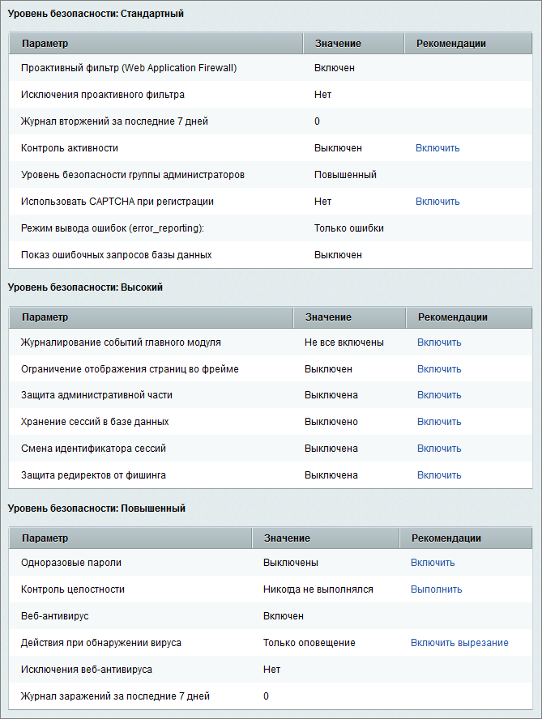{width=669px height=888px}

## Настройки модуля

Настройки модуля Проактивная защита расположены в административной части на странице *Настройки > Настройки продукта > Настройки модулей > Проактивная защита*.

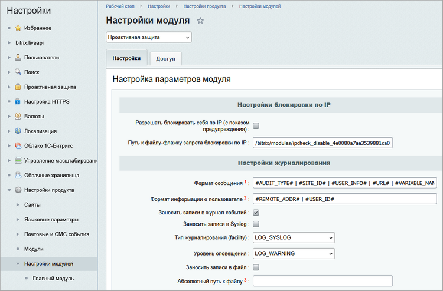{width=750px height=494px}

На этой вкладке Настройки можно настроить параметры блокировки по IP-адресу и журналирования событий.

### Настройки блокировки по IP

-  Разрешать блокировать себя по IP (с показом предупреждения) -- если опция включена, можно заблокировать свой IP-адрес. При первой попытке появится предупреждение, при второй -- выполнится блокировка.

-  Путь к файлу-флажку запрета блокировки по IP -- укажите путь к файлу-флажку, который снимает ограничения по IP. Файл создается вручную и помогает восстановить доступ при случайной блокировке. Название файла можно оставить по умолчанию или задать свое.

Пример работы с файлом-флажком:

1. Предположим, в настройках указан путь `/bitrix/modules/ipcheck_disable_ourproject267`.

2. Вы заблокировали свой IP. Появилась ошибка `403 Forbidden`.

3. Подключитесь к серверу по FTP и перейдите в `/bitrix/modules/`.

4. Создайте пустой файл с именем `ipcheck_disable_ourproject267`.

5. Блокировки снимутся, и доступ восстановится.

6. Зайдите в административный раздел, удалите IP из стоп-листа. Затем удалите файл-флажок, чтобы вернуть ограничения для других IP.



Удалите файл-флажок сразу после восстановления доступа. В настройках модуля и стоп-листе появится предупреждение.



### Настройки журналирования

-  Формат сообщения -- укажите формат записи данных о событии. Доступны поля:

   -  `#AUDIT_TYPE#` -- имя аудитора безопасности,

   -  `#SITE_ID#` -- идентификатор текущего сайта,

   -  `#USER_INFO#` -- информация о пользователе,

   -  `#URL#` -- запрашиваемыйURL,

   -  `#VARIABLE_NAME#` -- имя переменной, содержащей опасные данные,

   -  `#VARIABLE_VALUE#` -- опасные данные,

   -  `#VARIABLE_VALUE_BASE64#` -- опасные данные, base64-кодированные.

-  Формат информации о пользователе -- укажите формат записи данных о пользователе, связанным с событием. Доступны поля:

   -  `#REMOTE_ADDR#` -- IP-адрес,

   -  `#USER_AGENT#` -- User-Agent,

   -  `#USER_ID#` -- идентификатор пользователя.

-  Заносить записи в журнал событий -- если опция включена, информация о событиях будет занесена в журнал событий.

-  Заносить записи в Syslog -- если опция включена, информация о событиях будет занесена в системный журнал Syslog или штатный журнал событий ОС Windows.

-  Тип журналирования (facility) -- укажите [тип журналирования (facility)](http://php.net/manual/ru/function.openlog.php) для записей о событиях.

-  Уровень оповещения -- укажите [уровень оповещения (priority)](http://php.net/manual/ru/function.syslog.php) для записей о событиях.

-  Заносить записи в файл -- если опция включена, информация о событиях будет занесена в файл.

-  Абсолютный путь к файлу -- укажите путь к файлу, в который будет занесена информация о событиях.

### Доступ

На вкладке Доступ можно настроить права доступа к модулю для разных групп пользователей:

-  `[D] Доступ закрыт` -- доступ к модулю запрещен,

-  `[F] Обход проактивного фильтра` -- к пользователям группы не применяется проактивный фильтр,

-  `[S] Управление одноразовыми паролями` -- пользователи группы могут управлять одноразовыми продуктами,

-  `[T] Просмотр всех данных` -- разрешен просмотр данных модуля,

-  `[W] Полный административный доступ` -- полный доступ к ресурсам модуля.

{width=678px height=409px}

## Монитор проактивной защиты



С версии модуля Проактивная защита 24.0.0 доступен новый инструмент -- Монитор проактивной защиты.



Монитор проактивной защиты выполняет роль файрвола. Он обеспечивает предварительную защиту от уязвимостей на сайтах и порталах клиентов без установки основных обновлений продукта.

Монитор защищает сайты и порталы до установки обновлений, но не гарантирует полной защиты без них. Он блокирует подозрительные запросы и уведомляет о необходимости обновления.

### Как работать с монитором

В административном разделе рядом с вкладкой Администрирование отображается статус безопасности сайта.

{width=580px height=48px}

-  Оранжевый -- Угроза безопасности.

-  Зеленый -- Сайт под защитой или Портал под защитой.

#### Что делать, если статус изменился

Статус всегда виден на любой странице административного раздела, чтобы оперативно отслеживать ситуацию. Если статус сменился с зеленого на оранжевый, появится уведомление о подозрительных запросах.

#### Страница монитора

Клик по статусу откроет страницу *Настройки > Проактивная защита > Монитор проактивной защиты*.

Монитор собирает информацию об атаках и показывает ее в виде:

-  истории защиты,

-  графика Отражено атак.

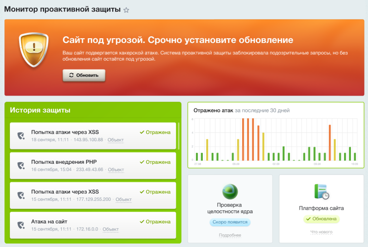{width=751px height=504px}

В баннере есть кнопка Обновить для быстрого перехода к обновлениям.



Не пренебрегайте обновлениями. Устанавливайте свежие версии продукта, чтобы обеспечить надежную защиту сайта или портала. Монитор проактивной защиты -- это ваш помощник, но основная защита зависит от своевременных обновлений.



## Сканер безопасности

Сканер безопасности -- это инструмент для поиска потенциальных ошибок и упущений в безопасности сайта.

### Как работает сканер

Сканер позволяет:

-  проверять внутреннее окружение проекта, например, безопасность хранения файлов сессий,

-  анализировать настройки сайта, к примеру, установлен ли пароль к базе данных,

-  искать уязвимости в коде проекта с помощью статического анализа,

-  запускать внешнее сканирование, если сайт доступен из интернета и в настройках Главного модуля указан правильный URL.

Сканер может замедляться при анализе скриптов объемом свыше 100 Кб. Рекомендуется временно удалять такие скрипты или разбивать их на части.

### Минимальные системные требования

Для статического анализа:

-  расширение `Tokenizer`,

-  `max_execution_time` -- не менее 20 секунд,

-  `memory_limit` -- не менее 256 Мб.

Для проверки прав доступа к файлам:

-  `max_execution_time` -- не менее 20 секунд.

### Как запустить сканирование

Чтобы выполнить проверку, откройте страницу *Настройки > Проактивная защита > Сканер безопасности* и нажмите кнопку Запустить сканирование. Система выполнит поиск угроз и предоставит рекомендации по их устранению. Для некоторых сообщений доступны подробные описания проблем в разделе Детали.

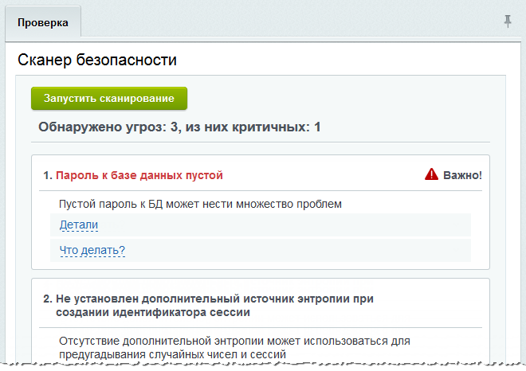{width=660px height=466px}

### Трактовка результатов сканера безопасности

Сканер безопасности разделен на две части: локальную и внешнюю. Внешнее сканирование проверяет сайт «снаружи». Локальное сканирование проверяет настройки сайта и выполнение скриптов внутри.

#### Локальное сканирование

Сообщения сканера, которые связаны с настройками окружения.



Проблема возникает, если директория хранения сессий, например, `/tmp/` доступна для всех пользователей. На shared-хостинге это может позволить другим пользователям получить доступ к вашим сессионным данным.

Решение:

-  Создайте отдельную папку для сессий. Например, внутри `/tmp/`.

-  Установите корректные права доступа.

-  Укажите новую папку в настройках PHP `session.save_path`.





Если несколько сайтов используют одну директорию для сессий. Это может привести к «сквозным» сессиям. Например, пользователь авторизуется на сайте B и получает сессию с `ID=7`. Если он перейдет на сайт A с той же сессией, он окажется авторизованным под пользователем с `ID=7` на сайте A.

Решение:

-  Укажите уникальную директорию для сессий каждого сайта.





Проблема возникает, если пользователь может загрузить файлы с опасными расширениями: `.php`, `.py`, `.psp`, `.pl`.

Решение:

-  Настройте веб-сервер так, чтобы он не исполнял скрипты в директории загрузок.





Злоумышленник может загрузить `.htaccess` с вредоносными настройками.

```
 <Files ~ "^\.ht"> Order allow,deny Allow from all </Files> AddHandler zend-enabler-script .htaccess <IfModule mod_mime.c> AddType application/x-httpd-php .htaccess </IfModule> #<?php assert($_GET[0]); ?>
```

Решение:

-  Найдите все `.htaccess` файлы в директории загрузок.

   ```
     $ find ./upload -type f -name '.htaccess' -print -exec cat {} \; ./upload/support/not_image/.htaccess Deny from all ./upload/.htaccess <IfModule mod_mime.c> RemoveHandler php .php3 .php4 .php5 .php6 .phtml .pl .asp .aspx .cgi .dll .exe .ico .shtm .shtml .fcg .fcgi .fpl .asmx .pht .py .psp AddType text/plain php .php3 .php4 .php5 .php6 .phtml .pl .asp .aspx .cgi .dll .exe .ico .shtm .shtml .fcg .fcgi .fpl .asmx .pht .py .psp </IfModule> <IfModule mod_php5.c> php_flag engine off </IfModule>
   ```

-  Перенесите их правила в конфигурацию виртуального хоста.

-  Добавьте `AllowOverride None` для директории загрузок.

   ```
   <Directory /home/bitrix/www/upload/support/not_image> AllowOverride none Order allow,deny Deny from all </Directory> <Directory /home/bitrix/www/upload> AllowOverride none AddType text/plain php .php3 .php4 .php5 .php6 .phtml .pl .asp .aspx .cgi .dll .exe .ico .shtm .shtml .fcg .fcgi .fpl .asmx .pht .py .psp php_value engine off </Directory>
       
   ```





Проблема возникает, если Apache может интерпретировать файлы с расширением `.var` как HTML, а не как изображение. Это создает возможность для XSS-атак.

Решение:

-  Отключите Content Negotiation в директории загружаемых файлов. Для этого удалите строку `AddHandler type-map .var` из конфигурации Apache.



Сообщения о настройках PHP.



Решение: установите `allow_url_fopen = Off` в настройках PHP.





При установке cookie сайт не передает дополнительный флаг `httpOnly` для HTTP-заголовка `Set-Cookie`, который указывает на запрет чтения/записи данных сookie посредством JavaScript.

Решение: установите `session.cookie_httponly = On` в настройках PHP.





Отсутствие дополнительной энтропии позволяет предугадывать случайные числа.

Решение: установите `session.entropy_file = /dev/urandom` и `session.entropy_length = 128`.





Решение: установите `asp_tags = Off`.





Хранение идентификатора сессии не только в сookies может служить источником атак разного типа.

Решение: установите `session.use_only_cookies = On`.





Вывод ошибок предназначен для разработки, он не должен использоваться на рабочем проекте.

Решение: установите `display_errors = Off`.



Сообщения сканера, которые касаются настроек сайта.



Решение: убедитесь, что список опасных расширений актуален.





Решение: включите проактивный фильтр для защиты от атак.





Решение: включите защиту редиректов для предотвращения атак через перенаправления.





Решение: повысьте уровень безопасности для администраторов.





Решение: установите `$DBDebug = false` в `/bitrix/php_interface/dbconn.php`.





Решение: убедитесь, что пароли к базе данных соответствуют требованиям безопасности:

-  не пустые,

-  содержат символы разных регистров, цифры и спецсимволы,

-  длина не менее 8 символов.



Сообщения сканера о результатах проверки пользователей.



Решение: убедитесь, что все администраторы используют сложные пароли.





Решение: включите двухэтапную авторизацию, чтобы повысить безопасность.





Решение: убедитесь, что все администраторы используют одноразовые пароли.



#### Внешнее сканирование



Решение: отключите `Directory AutoIndex` в настройках веб-сервера.





Решение: закройте доступ к внутренним сервисам из внешней сети, например, к memcached.





Решение: обновите PHP до актуальной стабильной версии или не используйте `php-cgi`.





Уязвимость связана с неправильной обработкой `PATH_INFO` в `PHP-FPM` при `cgi.fix_pathinfo=1`. Nginx может выполнять произвольные файлы как скрипты, если в URL добавлен поддельный php-суффикс.

Решение: установите `cgi.fix_pathinfo=0` или настройте Nginx корректно.





Решение: закройте доступ к статусным страницам, например, Apache `mod_status`.





Решение: удалите временные файлы и ограничьте доступ к ним.





Решение: удалите файлы, которые остались после отладки или установки: `bitrixsetup.php`, `bx_1c_import.php` и другие.





Решение: закройте доступ к настройкам PhpMyAdmin, чтобы предотвратить утечки конфигурации и уязвимости.





Решение: ограничьте доступ к служебным каталогам DCVS и файлам игнорирования: `.gitignore`, `.hgignore` и так далее.





Решение: включите защиту от фреймов, чтобы предотвратить атаки, такие как `Clickjacking`.





Решение: убедитесь, что сайт не отвечает на произвольные заголовки `Host`. Настройте сервер по умолчанию с перенаправлением на основной домен.





Решение: удалите файлы с выводом `phpinfo()`, такие как `x.php`, `pi.php`. Используйте встроенные инструменты для просмотра информации PHP.





Решение: отключите mime-сниффинг в Internet Explorer. Добавьте заголовок `X-Content-Type-Options: nosniff` в конфигурацию сервера.



## Стандартный уровень безопасности

Чтобы обеспечить стандартный уровень безопасности веб-проекта, настройте все параметры данного уровня.

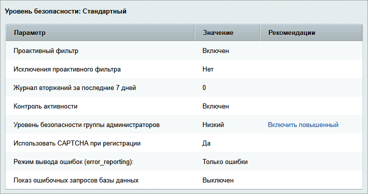{width=734px height=388px}

Если стандартный уровень настроен не полностью, защита сайта будет осуществляться на начальном уровне, но с учетом настроенных параметров всех уровней.

### Проактивный фильтр и исключения

Проактивный фильтр  -- это набор средств для фильтрации трафика, который обеспечивает защиту от большинства известных атак на веб-приложения. Он распознает и блокирует опасные угрозы в потоке внешних запросов пользователей.



Некоторые действия пользователей могут вызывать ложные срабатывания фильтра.



Настройка фильтра выполняется на странице *Настройки > Проактивная защита > Проактивный фильтр* и подробно описана в статье [Firewall](./firewall).



Для защиты на стандартном уровне проактивный фильтр должен быть включен, а исключения не заданы.



### Журнал вторжений

Журнал вторжений фиксирует события, которые связаны с потенциальными угрозами безопасности. Просмотр журнала выполняется на странице *Настройки > Проактивная защита > Журнал вторжений*, где  доступна информация:

-  дата и время события,

-  название события,

-  объект события,

-  IP-адрес, с которого производилась атака,

-  URL страницы, где произошло вторжение,

-  имя пользователя или идентификатор гостя,

-  описание события,

-  срочность: `SECURITY` или `WARNING`,

-  источник события,

-  User Agent,

-  сайт, на котором произошло событие.

В журнале фиксируются события следующих типов:

-  превышение лимита активности -- модуль Веб-аналитика,

-  попытки SQL-инъекций, XSS, фишинга -- модуль Проактивная защита,

-  операции на форуме -- модуль Форум,

-  события авторизации и регистрации -- Главный модуль.

### Контроль активности

Контроль активности позволяет защитить сайт от чрезмерно активных пользователей, роботов и DDoS-атак. Он доступен в тех лицензиях продукта, в которые входит модуль Веб-аналитика.

#### Как включить контроль активности

-  Перейдите на страницу *Настройки > Проактивная защита > Контроль активности*.

-  Нажмите кнопку *Включить контроль активности*.

-  Настройте параметры максимальной активности и фиксируйте события в журнале.

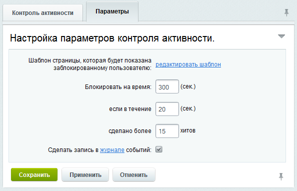{width=594px height=382px}



Контроль активности также можно настроить на странице *Настройки > Настройки продукта > Настройки модулей > Веб-аналитика*, закладка Настройки, секция Ограничение активности.



### Уровень безопасности группы администраторов

Для стандартного уровня безопасности необходимо установить повышенный уровень безопасности для группы администраторов.

1. Перейдите на страницу *Настройки > Проактивная защита > Панель безопасности*.

2. Нажмите ссылку Включить повышенный в строке с параметром *Уровень безопасности группы администраторов*.

3. В поле *Предопределенные настройки уровня безопасности* выберите Повышенный.

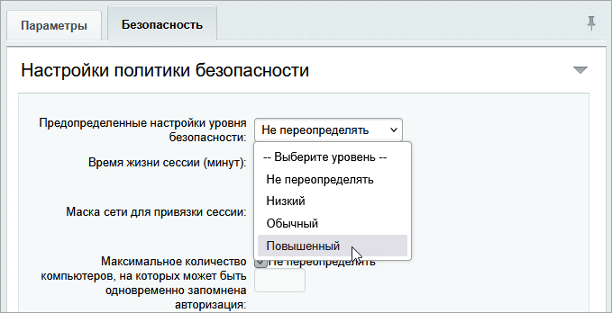{width=679px height=348px}

### Использовать CAPTCHA при регистрации

Для стандартного уровня безопасности необходимо включить CAPTCHA при регистрации новых пользователей.

1. Отметьте опцию *Использовать CAPTCHA при регистрации* в настройках Главного модуля на вкладке Авторизация.

2. Настройте внешний вид CAPTCHA на странице *Настройки > Настройки продукта > CAPTCHA*.

### Режим вывода ошибок

Для стандартного уровня безопасности настройте режим вывода ошибок `error_reporting`.

1. Перейдите на страницу настроек Главного модуля: *Настройки > Настройки продукта > Настройки модулей > Главный модуль*.

2. В поле *Режим вывода ошибок (error_reporting)* выберите Только ошибки или Не выводить

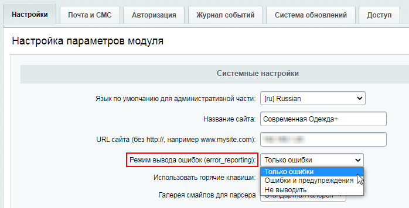{width=698px height=356px}



Если выбрать Ошибки и предупреждения, будет установлен начальный уровень безопасности.



### Показ ошибочных запросов базы данных

Для стандартного уровня безопасности показ ошибочных запросов базы данных должен быть отключен. Установите переменную `$DBDebug` в значение `code` в файле `/bitrix/php_interface/dbconn.php`, чтобы ограничить показ ошибок только администраторам.

## Высокий уровень безопасности

Чтобы обеспечить высокий уровень безопасности веб-проекта, сначала настройте стандартный уровень безопасности, а затем все параметры высокого уровня.

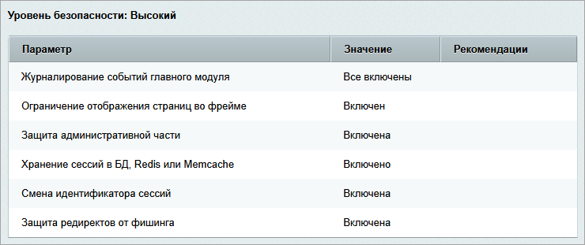{width=740px height=311px}

Если высокий уровень настроен не полностью, защита сайта будет осуществляться на стандартном или начальном уровне, но с учетом настроенных параметров всех уровней.

### Журналирование событий Главного модуля

Для высокого уровня безопасности необходимо включить журналирование всех событий Главного модуля.

1. Перейдите на страницу *Настройки > Настройки продукта > Настройки модулей > Главный модуль*.

2. Отметьте все опции в секции *События для записи в журнал*.

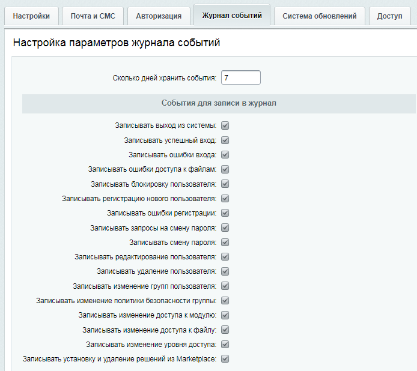{width=694px height=618px}

Если не отмечена хотя бы одна опция, защита сайта будет осуществляться на стандартном или начальном уровне.

### Ограничение отображения страниц во фрейме

Запрет на показ страниц сайта во фреймах сторонних доменов защищает от атак, таких как Clickjacking и Framesniffing.

1. Перейдите на страницу *Настройки > Проактивная защита > Защита от фреймов*.

2. Включите защиту на вкладке Защита от фреймов.

3. На вкладке Исключения можно указать страницы, для которых защита не будет применяться. Страницы указываются по маскам, например, `/bitrix/*` или `*/news/*`.

### Защита административной части

Защита административной части сайта ограничивает доступ к ней только с указанных IP-адресов.

1. Перейдите на страницу *Настройки > Проактивная защита > Защита административного раздела*.

2. Внесите в список IP-адреса, с которых разрешен доступ.

3. Нажмите кнопку Включить защиту.



Перед включением защиты убедитесь, что добавили свой IP-адрес в список разрешенных.



{width=762px height=536px}

### Хранение сессий в БД, Redis или Memcache

Хранение сессий в базе данных, Redis или Memcache исключает возможность чтения данных сессий через файловую систему.

1. Добавьте параметры хранения сессий в секцию `session` в файле `/bitrix/.settings.php`.

2. Убедитесь, что сессии хранятся в таблице модуля Проактивная защита.



При переключении режима хранения сессий все пользователи потеряют авторизацию.



### Смена идентификатора сессий

Смена идентификатора позволяет сделать похищение авторизованной сессии неэффективным.

1. Перейдите на страницу *Настройки > Проактивная защита > Защита сессий*.

2. Укажите *Время жизни идентификатора, в секундах*.

3. Нажмите кнопку *Включить смену идентификатора*.

{width=681px height=466px}



Смена идентификатора создает дополнительную нагрузку на сервер.



### Защита редиректов от фишинга

1. Перейдите на страницу *Настройки > Проактивная защита > Защита редиректов*.

2. Нажмите кнопку *Включить защиту редиректов от фишинга*.

3. Укажите методы защиты от фишинга:

   -  проверять наличие HTTP-заголовка, который описывает страницу,

   -  проверять наличие в HTTP-заголовке записи о текущем сайте,

   -  добавлять цифровую подпись к ссылкам.

4. Выберите одно из действий защиты от фишинга:

   -  перенаправить на другой сайт с сообщением и задержкой,

   -  перенаправить на безопасный адрес, например, на главную страницу сайта.

5. Чтобы фиксировать попытки фишинга, отметьте опцию *Занести попытку фишинга в журнал*.

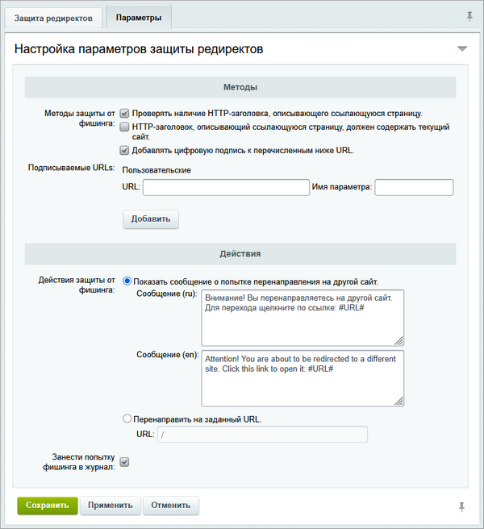{width=600px height=656px}

Для защиты от фишинга в код публичных страниц добавлены теги `noindex` и `nofollow`.



С версии 20.0.0 модуля Проактивная защита cтраница защиты от редиректов отдает HTTP-статус `404 Not Found`.



## Повышенный уровень безопасности

Чтобы обеспечить повышенный уровень безопасности веб-проекта, сначала настройте стандартный и высокий уровни, а затем все параметры повышенного уровня.

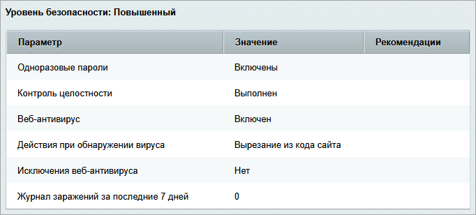{width=682px height=308px}

### Одноразовые пароли

Включите двухэтапную авторизацию для дополнительной защиты учетных записей. При каждой авторизации пользователь вводит:

1. Логин и пароль.

2. Одноразовый код из мобильного приложения или специального устройства.

Такой подход повышает защиту от фишинга и кражи учетных данных. Подробнее о настройке двухэтапной авторизации читайте в статье [Двухэтапная авторизация.](./two-factor-auth)

### Контроль целостности

Контроль целостности  проверяет файлы системы на наличие изменений, которые могут быть признаком взлома.

-  Регулярно проверяйте целостность системы на странице *Настройки > Проактивная защита > Контроль целостности*.

-  Выполняйте проверку целостности перед обновлением системы, а после обновления собирайте новую  информацию по файлам.

#### Первый запуск проверки целостности

1. Перейдите на страницу *Настройки > Проактивная защита > Контроль целостности*.

2. Введите пароль из латинских букв и цифр, длиной не менее 10 символов.

3. Подтвердите пароль.

4. Задайте ключевое слово, отличное от пароля, и запомните его.

5. Нажмите Далее. Если все введено правильно, вы увидите сообщение об успешном подписании скрипта.

   {width=653px height=515px}

#### Сбор информации по файлам

1. Отметьте опцию *Собрать информацию по файлам* на вкладке Выбор действия.

2. Нажмите Далее.

   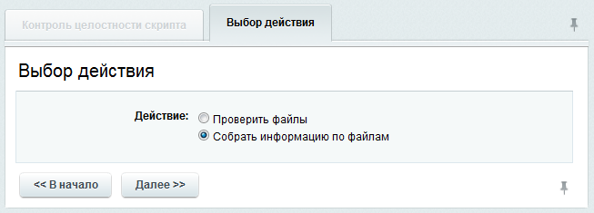{width=653px height=235px}

3. Настройте параметры сбора.

   -  Выберите папки для обработки.

   -  Укажите расширения файлов через запятую (например, php, js, htaccess).

   -  Введите пароль для шифрования данных.

   -  Укажите количество секунд для выполнения одного шага.

4. Нажмите Далее.

   {width=655px height=383px}

5. Скачайте файл с данными на локальный компьютер.

   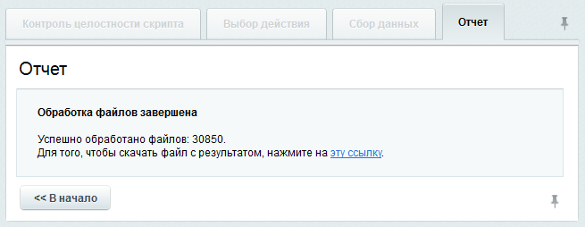{width=655px height=254px}

#### Проверка целостности системы

1. Введите пароль, которым подписали скрипт, и нажмите Далее.

2. Убедитесь, что в сообщении о результатах проверки указано ваше кодовое слово. Если нет, скрипт был изменен, и его результатам доверять нельзя.

3. Отметьте опцию *Проверить файлы* на вкладке Выбор действия.

4. Нажмите Далее.

   {width=652px height=236px}

5. Выберите лог-файл из системы или загрузите его с компьютера.

6. Нажмите Далее.

   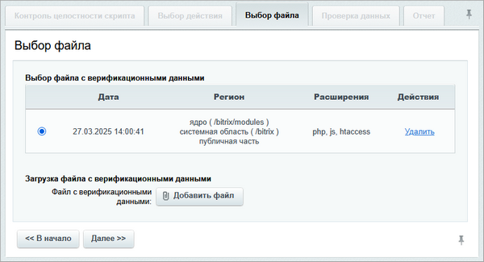{width=600px height=325px}

7. Введите пароль для дешифрования.

8. Укажите время выполнения одного шага проверки.

9. Нажмите Далее.

   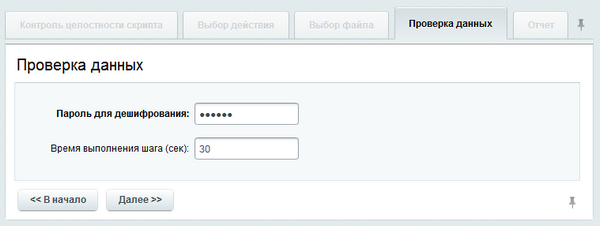{width=600px height=226px}

   Начнется процесс проверки, по окончании которого будет выведен отчет.

   {width=600px height=194px}

### Веб-антивирус

Веб-антивирус защищает сайт от заражения вирусами. Он выявляет и вырезает подозрительные объекты из HTML-кода.

1. Перейдите на страницу *Настройки > Проактивная защита > Веб-антивирус*.

2. Нажмите кнопку *Включить веб-антивирус*.

3. На вкладке Параметры укажите действие при обнаружении вируса и интервал оповещения.

   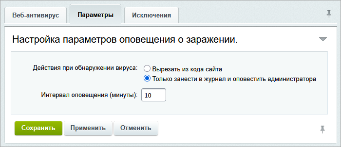{width=700px height=303px}

4. Если веб-антивирус срабатывает на легитимный код, добавьте строку из этого кода в исключения.

   {width=698px height=323px}

#### Действия при обнаружении вируса

1. Проверьте все компьютеры сотрудников, имеющих доступ к сайту и к панели администрирования.

2. Смените пароли от сервера всем пользователям.

3. Удалите сторонний код с сервера.

Чтобы обнаружить вирусы, которые внедрены до старта буферизации вывода, настройте параметр `auto_prepend_file`:

-  в `php.ini`:

```
auto_prepend_file = /www/bitrix/modules/security/tools/start.php
```

-  или в `.htaccess`:

```
php_value auto_prepend_file "/www/bitrix/modules/security/tools/start.php"
```

## Поиск троянов

Инструмент Поиск троянов сканирует файлы сайта на наличие потенциально вредоносного кода.

### Как выполнить сканирование

1. Перейдите на страницу *Настройки > Проактивная защита > Поиск троянов > Сканирование файлов*.

2. Нажмите кнопку Начать поиск.

   По умолчанию сканирование начинается от корня сайта `/home/bitrix/www/`. Можно указать другую папку в поле Начальный путь.

3. Отметьте файлы и скачайте их, чтобы выполнить проверку обычным антивирусом или на сайте [www.virustotal.com](http://www.virustotal.com)



Не все найденные файлы являются вредоносными. Некоторые могут содержать легитимный код, который сканер ошибочно помечает как подозрительный.



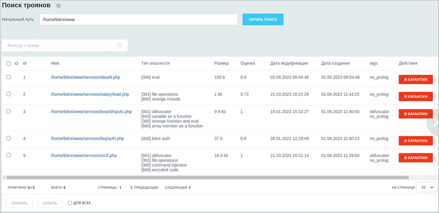{width=750px height=364px}

### Детальная информация

Нажмите по имени файла, чтобы просмотреть подробную информацию:

-  имя и расположение файла,

-  даты создания и модификации,

-  оценка угрозы от 0 до 1,

-  подозрительный код,

-  полное содержимое файла.

#### Анализ файла

Внимательно изучите содержимое файла, особенно выделенные подозрительные участки кода.\
Учтите, что файлы с низкой оценкой могут содержать угрозы, а файлы с высокой оценкой могут быть ложными срабатываниями.

#### Действия с файлами

-  Переместить в карантин -- файл будет переименован, чтобы предотвратить его выполнение. Например, `.php` --> `.ph_`.

   -  Если файл используется на сайте, это может привести к его неработоспособности.

   -  Чтобы восстановить файла из карантина, используйте кнопку Восстановить или переименуйте вручную файл обратно.

-  Скрыть из результатов -- файл будет исключен из списка до следующего сканирования.

-  Редактировать -- файл будет открыт, чтобы изменить или удалить подозрительный код.



Перед внесением изменений, убедитесь в наличии доступа по FTP/SSH для возможности отката.



### Проверка операционной системы

Кроме сканирования файлов рекомендуется проверить:

-  подозрительные процессы на сервере,

-  посторонние задания в `crontab`,

-  посторонние SSH-ключи.

#### Как выполнить проверку

Перейдите на страницу *Настройки > Проактивная защита > Поиск троянов > Операционная система*. На ней отображаются результаты выполнения команд:

-  `whoami`

-  `ps ux -u whoami`

-  `crontab -l`

-  `last -i whoami`

-  `cat ~/.ssh/authorized_keys`

-  `stat ~/.ssh/authorized_keys`

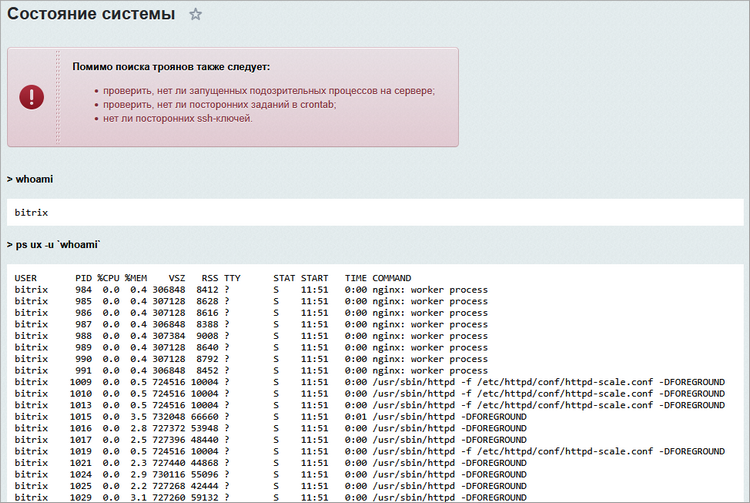{width=750px height=503px}

### Проверка файлов .htaccess

Для дополнительной безопасности можно проверить файлы `.htaccess`.

1. Перейдите в *Настройки > Проактивная защита > Поиск троянов > Проверка .htaccess*.

2. Просмотрите и отредактируйте файлы .htaccess.

3. Удалите ненужные файлы и оставьте минимальный набор:

   -  `/home/bitrix/www/bitrix/updates/.htaccess`

   -  `/home/bitrix/www/bitrix/php_interface/.htaccess`

   -  `/home/bitrix/www/bitrix/modules/.htaccess`

   -  `/home/bitrix/www/.htaccess`

   -  `/home/bitrix/www/upload/.htaccess`

   -  `/home/bitrix/www/upload/1c_exchange/.htaccess` -- этот файл появляется, если настроен обмен с 1С и существует директория `/upload/1c_exchange/`

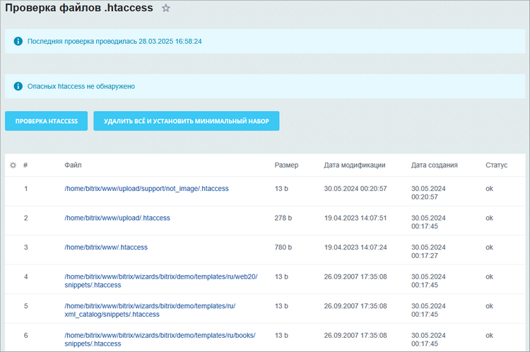{width=750px height=498px}

### Примеры вредоносного кода

-  Выполнение произвольного кода.

   {width=750px height=58px}

   {width=750px height=60px}

   {width=750px height=98px}

   {width=750px height=117px}

   {width=750px height=116px}

   {width=750px height=196px}

   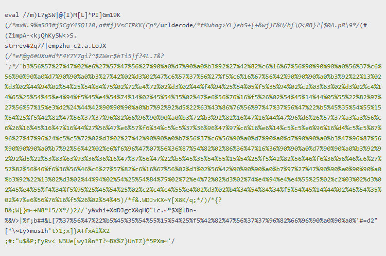{width=750px height=498px}

-  Cоздание файла, через который впоследствии будет выполняться произвольный код.

   {width=750px height=79px}

-  Отправка спам-писем на произвольные адреса.

   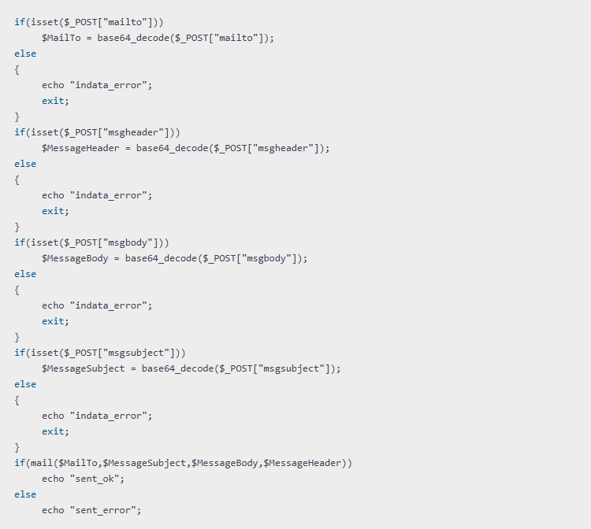{width=750px height=672px}

-  Авторизация под администратором без проверок пароля и двухфакторной авторизации.

   {width=750px height=98px}

### Антивирус Касперского

Дополнительно можно использовать приложение Kaspersky Virus Removal Tool для проверки сайта. Для этого в консоли выполните специальные команды.

1. Создайте временную папку и перейдите в эту папку.

   ```bash
   mkdir -p /tmp/kaspersky && cd /tmp/kaspersky
   ```

2. Скачайте антивирус.

   ```bash
   wget https://devbuilds.s.kaspersky-labs.com/kvrt_linux/latest/kvrt.run
   ```

3. Добавьте права на выполнение.

   ```bash
   chmod +x kvrt.run
   ```

4. Запустите антивирус.

   ```bash
   ./kvrt.run --allowuser -- -accepteula -silent -dontencrypt -d "/tmp/kaspersky/report" -custom /home/bitrix/www/
   ```

   В параметре `-custom` необходимо указать путь к корню сайта.

После проверки будет выведен краткий отчет. Полный отчет расположен в папке `/tmp/kaspersky/report/`.



Антивирус создает отчет, но не удаляет и не лечит файлы. Обработку файлов нужно выполнять вручную.



## Стоп-лист

Проактивная защита включает в себя Стоп-лист, который блокирует доступ к сайту или его разделам для определенных IP-адресов.

### Как сформировать Стоп-лист автоматически

Правила блокировки IP-адресов добавляются в список автоматически в двух случаях.

1. Включена защита административной части сайта.

2. Проактивный фильтр обнаруживает вторжение и настроен на добавление IP-адреса атакующего в стоп-лист.

### Как добавить правила блокировки вручную

1. Перейдите на страницу *Настройки > Проактивная защита > Стоп-лист*.

2. Нажмите кнопку Добавить.

3. Заполните форму блокировки.

   -  Можно заблокировать доступ как к административной, так и к публичной части сайта.

   -  Укажите IP-адреса или диапазоны адресов, которые нужно заблокировать.

   -  Укажите маски путей или разделы сайта, доступ к которым нужно заблокировать. Например, `/admin/*`.

   -  Исключения можно задать по IP-адресам и маскам путей.

   

   Каждый IP-адрес или маска пути следует вводить в отдельное поле с помощью кнопки Добавить. Диапазон IP-адресов указывается через дефис, например, `192.168.0.1-192.168.0.100`.

   

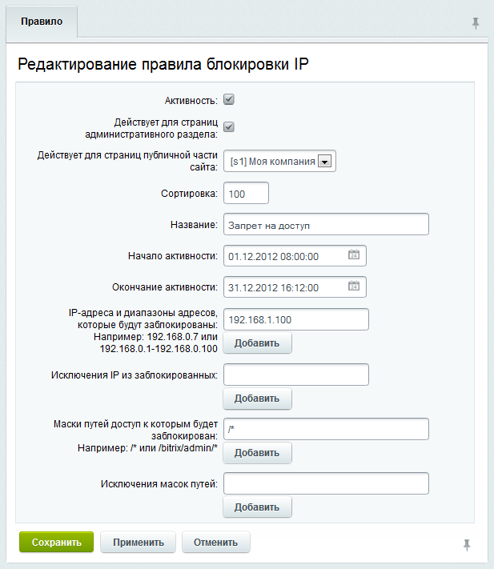{width=617px height=711px}

### Результат блокировки

Пользователи с заблокированными IP-адресами получат ошибку `HTTP 403 – доступ запрещен` при попытке зайти на сайт.

## Хосты/домены

На странице *Настройки > Проактивная защита > Хосты/домены* можно настроить ограничение доступа и перенаправление запросов, если HTTP-заголовок `Host` не соответствует разрешенным адресам.

Подробное описание параметров:

1. Ограничивать -- включает режим ограничения для запросов с неправильными заголовками `Host`.

2. Логировать -- записывает в журнал информацию о запросах с неправильными заголовками.

3. Активная реакция:

   -  Запрещать доступ -- блокирует доступ к сайту.

   -  Перенаправлять -- перенаправляет запросы на страницу, указанную в следующем параметре.

4. Адрес перенаправления -- укажите страницу, на которую будут перенаправляться запросы с неправильными заголовками.

5. Список разрешенных хостов/доменов -- укажите домены или хосты, которые считаются разрешенными. Допускается запись хостов через пробел и с новой строки. Возможно использование символа `*` для указания поддоменов.

   

   При многосайтовости на разных доменах обязательно укажите домены всех сайтов в списке разрешенных, чтобы избежать ошибки 403.

   

{width=716px height=483px}